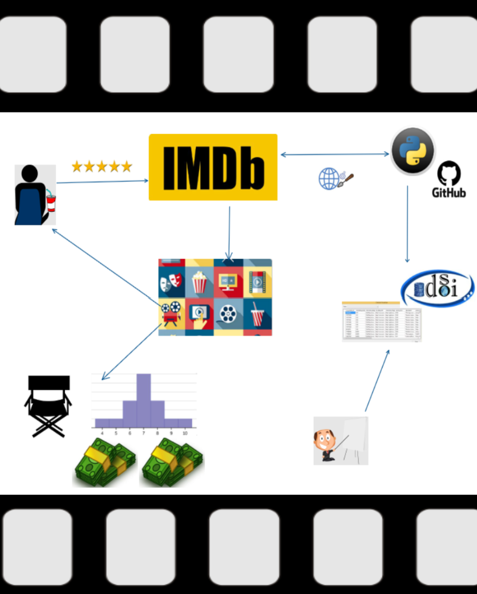

```{r setup, include=FALSE}
knitr::opts_chunk$set(echo = FALSE,
                      message = FALSE,
                      warning = FALSE)
```

```{r 1, fig.align = 'centrer'}
kableExtra::kable_styling(
  kableExtra::row_spec(
    kable_input = knitr::kable(
      data.frame( 'Dades' = c('Autors',
                              'Portal web escollit',
                              'Repositori',
                              'Zenodo',
                              'Vídeo'),
                  'Contingut'  = c('Eric Farran Moreno i Jordi Alvarez Pitarque',
                                   'https://www.imdb.com/chart/top/?ref_=nv_mv_250',
                                   'https://github.com/efarran0/TiCdV_DADES_PR1',
                                   'https://zenodo.org/records/10960898',
                                   'https://drive.google.com/drive/folders/1Ed7G3YkAmBDw_w45jENvpWfCfVnZbtaK')),
      caption = 'Resum'),
    row = 0,
    bold = TRUE),
  latex_options = 'hold_position')
```

# Context

El lloc web seleccionat per a l’estudi de web scraping és el de les 250 pel·lícules top segons IMDb (Acrònim d’Internet Movie Database)[^1]. Es tracta d’una web que conté una base de dades en línia amb informació relacionada amb pel·lícules, sèries i programes de televisió principalment, com el repartiment, els productors, sinopsis, curiositats, valoracions, gènere, o fins i tot opinions de cinèfils i crítics.

Hem decidit aquesta elecció perquè es tracta d’una font confiable i molt reconeguda d’informació de pel·lícules. En concret aquest recurs que presentem és bastant rellevant perquè classifica les 250 pel·lícules més valorades per els usuaris d’IMDb. És important perquè ens proporciona informació sobre les preferències cinematogràfiques dels usuaris.

Un altre motiu per fer web scraping sobre IMDb, és que l’API (Application Programming Interface) proporcionada a través de Amazon Data Exchange, és de pagament.

Amb la popularitat actual de les plataformes de streaming és important conèixer quin tipus de contingut prefereix l’audiència. El fet d’analitzar les pel·lícules més valorades, podem obtenir informació per a predir futures tendències de consum dels espectadors.
La pregunta que ens podem fer és: Quines característiques comparteixen les pel·lícules més valorades per els usuaris?

[^1]: https://www.imdb.com/chart/top/?ref_=nv_mv_250

# Títol

IMDb dataset: Característiques de les 250 pel·lícules més valorades en abril 2024

\newpage

# Descripció dataset

El conjunt de dades titulat “IMDb Top 250: Característiques de les pel·lícules més valorades en abril 2024”, és una recopilació d’informació detallada de les 250 pel·lícules més valorades d’IMDb en abril 2024. Aquest dataset inclou atributs com el títol, l’any de llançament, la classificació, el gènere o gèneres, la duració, el rating, el nombre les ressenyes, el director o directora, el pressupost i els ingressos per taquillatge totals.

Cada entrada del dataset representa una única pel·lícula de la llista de les 250 millors d’IMDb, proporcionant una visió exhaustiva  de les característiques que la fan tant ben valorades pels espectadors. Aquest conjunt de dades serà una font d’informació confiable de qualsevol persona interessada en l’anàlisi de tendències cinematogràfiques, o simplement per a persones que busquen tresors per veure.
Destaquem que aquest conjunt de dades s’ha obtingut amb tècniques de web scraping de forma responsable i ètica, respectant les condicions de servei d’IMDb i sense sobrecarregar els seus servidors.

# Representació gràfica

{width=70%}


# Contigut dataset

El conjunt de dades proporcionat conté les següents característiques de cadascuna de les pel·lícules dins la llista de les 250 millors d’IMDb:

**Title**: Títol original

**Genre**: Conjunt de gèneres

**Year**: Any de llançament

**Classification**: Classificació en diferents format

**Duration**: Durada en hores i minuts

**Rating**: Qualificació promig

**Review**: Número de ressenyes

**Director**: Director o directora

**Budget**: Pressupost en moneda local

**Collection**: Ingressos de taquillatge totals

El període de temps al que pertanyen les dades és el moment d’extracció de les dades atès que les 250 millors pel·lícules d’IMDb s’actualitza regularment en funció de les qualificacions dels usuaris.
En aquest cas, la darrera extracció es realitza en data del 11 d’abril del 2024.

# Propietari

Encara que IMDb és una companyia d’Amazon, opera com entitat independent amb la seva pròpia junta directiva, per tant, té autoritat sobre les seves pròpies dades. IMDb és reconegut com a font confiable i autoritzada d’informació sobre pel·lícules i sèries. Per exemple, la famosa revista “Fotogramas” especialitzada en cinema fa citacions d’aquesta base de dades en línia en els seus articles.

A continuació es citen anàlisis anteriors de la mateixa font d’informació:

- Sentiment Classification of IMDB Movie Review Data Using a PyTorch LSTM Network. \
Es tracta d’un estudi que utilitza les ressenyes de pel·lícules d’IMDb per a predir si la ressenya de la pel·lícula te un sentiment positiu o negatiu[^2].

- Quantitative approaches for evaluating the influence of films using the IMDB data base. \
Es tracta d’un estudi sobre la influència de certes pel·lícules al llarg de la història del cinema en base a les citacions que rep[^3]. 

- Exploratory data analysis of the IMDb’s movie database from a data scientist perspective. \
Es tracta d’un anàlisi de les dades d’IMDb utilitzant R amb ggplot2, com indica el títol, per a visualitzar les qualificacions i metadades de les pel·lícules de la font d’IMDb[^4].

\newpage

Finalment, els passos que seguim per actuar d’acord amb els principis ètics i legals són els següents:

**1. Verificació de l’arxiu robots.txt**: abans de fer web scraping sobre IMDb, es comprova els permisos del user-agent i els directoris permesos

**2. Respectar les condicions del servei**: Es respecten els termes del servei d’IMDb i no s’utilitzen les dades recopilades per a finalitats comercials. https://developer.imdb.com/non-commercial-datasets/ 

**3. Minimització de la càrrega del servidor**: Ens assegurem de no sobrecarregar els servidors d’IMDb fent web scraping de forma responsable, per exemple, afegint retards entre peticions.

**4. Privacitat de les dades personals**: Encara que les dades d’IMDb són públiques, no s’inclou cap informació de caràcter personal identificable en el nostre dataset.

[^2]: https://visualstudiomagazine.com/articles/2022/03/21/sentiment-classification-imdb.aspx

[^3]: https://www.lluiscodina.com/influence-films-imdb-database/

[^4]: https://minimaxir.com/2018/07/imdb-data-analysis/

# Inspiració

En aquesta extracció de dades a partir d’utilitzar la tècnica de scraping a IMDb, ens inspirem en la creixent importància i popularitat de l’anàlisi de dades a la indústria del cinema. Amb la proliferació de les plataformes de streaming com HBO, Netflix, Amazon Prime, Rakuten, Disney+, AppleTV, Movistar+ o SkyShowTime cada vegada és més important entendre quin tipus de contingut ressona entre l'audiència.

El conjunt de dades de les 250 millors pel·lícules d'IMDb és interessant perquè representa les pel·lícules més valorades pels usuaris d'IMDb. Això ens proporciona una visió de les preferències dels espectadors i ens permet analitzar les característiques que fan que una pel·lícula sigui exitosa.
Algunes de les preguntes que pretenem respondre amb aquest dataset són:

- Quines són les característiques en comú de les pel·lícules més valorades?

- Com han canviat les preferències dels espectadors al llarg del temps?

- Hi ha una correlació entre el pressupost d'una pel·lícula i la seva valoració a IMDb?

- Com influeixen els directors a la qualificació d'una pel·lícula?

En comparació amb les anàlisis anteriors que s'esmenten a l’apartat anterior, aquest estudi es centra específicament en les 250 millors pel·lícules d'IMDb, fet que ens permet aprofundir en les característiques de les pel·lícules més reeixides. Mentre  que altres anàlisis es poden centrar en aspectes més generals de la filmografia o en conjunts de dades més àmplies, aquesta extracció concreta ens permet centrar-nos en un conjunt de dades més específic i potencialment desvetllar aspectes únics sobre les pel·lícules més valorades.

# Llicència

Per al conjunt de dades resultant d’aquest projecte, una opció adequada pot ser la llicència Released Under CC BY-NC-SA 4.0 License. Aquesta és una llicència Creative Commons que permet a altres, adaptar i elaborar sobre aquest treball per a fins no comercials, sempre que et donin crèdit i llicenciïn les seves noves creacions sota els mateixos termes.
Aquesta llicència és apropiada pels següents motius:

**Reconeixement (BY)**: Permet que altres utilitzin el teu conjunt de dades mentre et referenciïn. Això t’aporta reconeixement.

**No Comercial (NC)**: Impedeix que altres utilitzin aquest dataset per a finalitats comercials. Aquest fet és important perquè aquestes dades procedeixen d’IMDb i hem d’heretar les seves condicions d’ús respecte les seves dades

**Compartir Igual (SA)**: Permet que altres transformin i elaborin sobre aquesta informació, sempre que es distribueixinels seus treballs sota la mateixa llicència que l'original. Això promou l’intercanvi deconeixements.

# Codi font i dataset

El programa de recol·lecció de dades web emprat en aquesta pràctica es divideix a l’hora en dos programes. El primer conté les instruccions requerides per obtenir de manera autònoma les direccions web a les 250 millors pel·lícules valorades en IMDb i tots els camps especificats en l'apartat de contingut mentre que, el segon programa, executa al primer.

El procés de recerca es dur a terme mitjançant la llibreria BeautifulSoup de python especificant l’etiqueta que es vol obtenir i a la classe a la que pertany aquesta. No obstant l’anterior, no totes les dades es distingeixen exclusivament per l’etiqueta i la classe. Així doncs, una de les problemàtiques que s’han solventat al programa és la discriminació de dades amb característiques comunes dins el portal web. A més, també s’ha volgut obtenir el llistat d’actors principals que han participat en cada pel·lícula així com el nombre de nominacions als Oscars però, en aquest cas, les dades no s'han pogut extreure.

```{r 2, fig.align = 'centrer'}
kableExtra::kable_styling(
  kableExtra::row_spec(
    kable_input = knitr::kable(
      data.frame('Contribucions' = c('Investigació prèvia', 'Redacció de les respostes', 'Desenvolupament del codi', 'Participació al vídeo'),
                 'Signatura' = c('EFM, JAP', 'EFM, JAP', 'EFM, JAP', 'EFM, JAP')),
      caption = 'Contribucions'),
    row = 0,
    bold = TRUE),
  latex_options = 'hold_position')
```

\newpage

**Referències**

1. Las 250 mejores películas de IMDb.\
https://www.imdb.com/chart/top/?ref_=nv_mv_250/ \
[Consultat el 03/04/2024]

2. McCaffrey, J (2022, Març 21). Sentiment Classification of IMDB Movie Review Data Using a PyTorch LSTM Network. Visual Studio Magazine.\
https://visualstudiomagazine.com/articles/2022/03/21/sentiment-classification-imdb.aspx/

3. Canet, Fernando; Valero, Miguel Angel; Codina, Lluís. (2016). «Quantitative approaches for evaluating the influence of films using the IMDb database». Communication & Society 29(2), 151-172.\
https://doi.org/10.15581/003.29.2.151-172

4. Woolf, M (2018, Juny 16). Analyzing IMDb Data The Intended Way, with R and ggplot2. Max Woolf's Blog.\
https://minimaxir.com/2018/07/imdb-data-analysis/

5. Introducing the New IMDb API.\
https://developer.imdb.com/ \
[Consultat el 04/04/2024]

6. I’m the CEO of IMDb. Here’s the one thing I tell every new hire.\
https://www.aboutamazon.com/news/workplace/imdb-ceo-col-needham-amazon-anniversary/ \
[Consultat el 08/04/2024]

7. Press Room - IMDb.\
https://www.imdb.com/pressroom/bio/ \
[Consultat el 08/04/2024]

8. Las 100 mejores películas de la historia del cine, ordenadas en ranking.\
https://www.fotogramas.es/noticias-cine/g6879913/las-50-mejores-peliculas-de-la-historia-segun-los-usuarios-de-imdb/ \
[Consultat el 08/04/2024]

9. Vikipèdia Fotogramas.\
https://ca.wikipedia.org/wiki/Fotogramas/ \
[Consultat el 08/04/2024]

10. Tipus de llicències Creative Commons.\
https://xtec.gencat.cat/ca/centres/propintel_dretauto/llicencies_cc/ \
[Consultat el 09/04/2024]

11. Los 6 tipos de licencias Creative Commons (IMF).\
https://blogs.imf-formacion.com/blog/corporativo/marketing-digital/6-tipos-de-licencias-creative-commons/ \
[Consultat el 09/04/2024]
